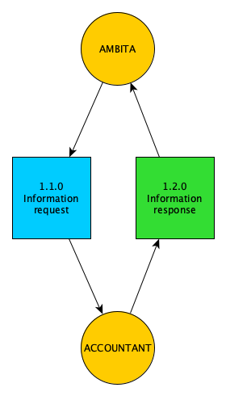
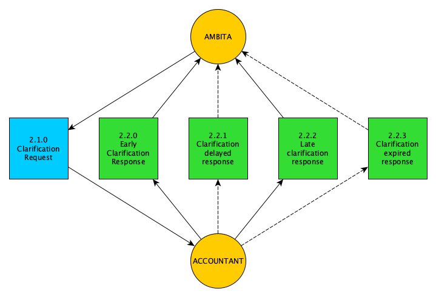
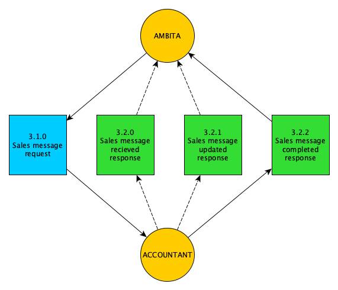
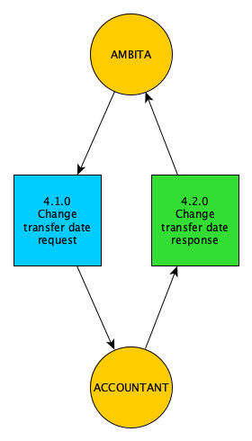

# Samhandling Megler Boligbyggelag

Documentation for cooperation between brokers and accountants

Ambita has designed a set of API messages to capture the flow between a broker and an accountant.   
We have split the process into separate steps:

1. Boliginformasjon (Information about the object). Used to inform the broker about which rules that apply to the sale of a given object.
2. Forhåndsutlysing (Advance clarification). If the seller wants to, he or she can clarify any preemption before the object is sold.
3. Salgsmelding (Sales message). The broker informs the accountant about the object being sold.
4. Endring overdragelsesdato (Change of transfer date). The broker requests a new transfer date
5. Endring kjøpere (Change of buyers). The broker requests a change of buyers (new owners)
6. Sluttbrev (Final letter). The accountant accepts that the process is completed.
7. Restanse (Arrears). The broker requests what payment needs to be fulfilled.

### Messages

The message format and process is described in more detail per product.  
You may take a look at the typescript types for the messages here:

* [Request types](requestTypes.ts)
* [Response types](callbackTypes.ts)

### General information about the message flow

Each flow starts with an order from a broker using the Vitec Next platform.  
This order will trigger a request from our system to the accountant's backend.  
The accountant will send one or more response messages back to us, and we will transform these into a series of operations on Vitec Next.  
The first version of the system relies heavily on PDF files that we deliver into the project archive.  
These files will gradually be replaced with API calls that push the structured data into the broker system.  
This will be done with little or no effect on the accountant integrations.

The messages are sent as JSON objects over HTTPS, as POST requests to the accountant.  
Responses are sent back to us as POST requests. In other words, the communication is asynchronous.

### Comments on message flow

The following descriptions define a set of flows between us and the accountant system.  
The messages are described in a way that assumes that the process is fully automated and that the accountant can handle operations themselves.  
Sometimes part of the flow is handled outside the accountant system.  
In these cases, we will inform the broker about this. The broker will then have to handle the operation manually.

To explain this in more detail the process can be viewed as three separate large operations: 

 * Clarification
 * Ownership change
 * Arrears

All messages interact with these three operations.
Special handling is required if the accountant system is not used to handle any one of these. 

## 1. Information about the object / Boliginformasjon

The first thing a broker needs to do is to find out which operations can be done at all,  
which of them can be 
done digitally and which of them they need to continue to do manually.  
This can differ from one sales project 
to the next. This product can be ordered by the broker, and we will forward it to the correct recipient.  
If the recipient is not part of the system, we will inform the broker about this.



### 1.1.0 Information request (Boliginformasjon)

On behalf of the broker the following request is made:

```json
{
  "type": "boliginformasjon",
  "ordreId": "1888e14e-1418-4d37-b3be-0d0b623681ba",
  "registerenhet": {
    "type": "matrikkel",
    "ident": "3802-71-119-0-21"
  },
  "bestiller": {
    "id": "TBF",
    "navn": "Broker Doe",
    "epost": "tbf@domene.no",
    "telefon": "79119911"

  },
  "meglerkontor": {
    "orgnr": "987654323",
    "avdelingsnr": "3",
    "navn": "Avdeling3",
    "adresse": {
      "gateadresse": "Testvei 3",
      "postnummer": "0030",
      "poststed": "OSLO"
    },
    "telefon": "12345678"
  },
  "kontaktperson": {
    "id": "AO",
    "navn": "Anne Olsen",
    "epost": "aol@domene.no",
    "telefon": "12548630"
  }
}
```

#### Request fields that are in all requests

* type - The request message type. Defines the following flow. Can be one of four different types:
  * boliginformasjon
  * forhandsutlysing
  * salgsmelding
  * restanse
* ordreId (order id) - A unique identifier that will be included in the responses
* registerenhet (realty) - A cadastre, share, stock or obligation property
  * type - type of realty
    * matrikkel (cadastre) - This is a cadastre in the Land Registry
    * borettsandel (cooperative share) - This is a share in the Land Registry
    * aksjeandel (stock share) - This is a privately held share property
    * obligasjonsandel (bond share) - This is a privately held bond property
  * ident - the unique identifier for the realty
* bestiller (orderer) - The broker making the product order
  * id - A unique identifier within the broker office
  * navn (name) - The name of the broker
  * epost (e-mail) - The e-mail of the broker
  * telefon (phone) - The phone number of the broker
* meglerkontor (broker department)
  * orgnr (organisation number) - The organisation number of the broker
  * avdelingsnr (department number) - The broker department number
  * navn (name) - The name of the broker department
  * adresse (address) - The address of the broker department
    * gateadresse (street address) - The street address with number and letter
    * postnummer (postal number) - The postal number of the address
    * poststed (postal place) - The postal place name of the address
  * telefon - The phone number of the broker department
* kontaktperson (person to contact) - Person to contact about the order, e.g. the main broker
  * id - A unique identifier within the broker office
  * navn (name) - The name of the broker
  * epost (e-mail) - The e-mail of the broker
  * telefon (phone) - The phone number of the broker

### 1.2.0 Information response (Boliginformasjon)

The accountant responds with information about the given object, here identified with the cadastre identity 
3802-71-119-0-21.  
This response is just an example:

```json
{
  "forkjopsrett": {
    "harForkjopsrett": true,
    "kanForhandsutlyses": true,
    "intern": true,
    "bestillingsformat": "Elektronisk",
    "gebyr": 7225
  },
  "styregodkjenning": {
    "pakrevd": true,
    "bestillingsformat": "Manuelt",
    "mottakerType": "forretningsforer"
  },
  "salgsmelding": {
    "bestillingsformat": "Manuelt",
    "gebyr": 6850
  },
  "restanse": {
    "bestillingsformat": "Manuelt"
  },
  "andreHensyn": "Kundeforhold avsluttes 1.1.2023 - det gjenstår endel i forbindelse med regnskap og TPO for 2022",
  "type": "boliginformasjon",
  "ordreId": "1888e14e-1418-4d37-b3be-0d0b623681ba",
  "forretningsforer": {
    "navn": "UNTL",
    "adresse": {
      "gateadresse": "Postboks 112 Lier",
      "postnummer": "0501",
      "poststed": "Oslo"
    },
    "epost": "post@kunde.no"
  },
  "klient": {
    "klienttype": "Borettslag tilknyttet",
    "organisasjonsnavn": "Skauen Borettslag",
    "organisasjonsnummer": "948677202",
    "epost": "styret@brl.no",
    "styreleder": {
      "navn": "Ole Styreleder",
      "epost": "leder@brl.no",
      "telefonnr": "99889988"
    }
  },
  "levert": "2022-07-07T15:48:07.6328836Z",
  "referanse": "622/1",
  "eierform": "Seksjonseier"
}
```

#### Response fields

General comment. For each step in the process, we have a field called "bestillingsformat".  
This field can be of two types: "Elektronisk" or "Manuelt".  
"Elektonisk" means that the step 
can be completed through the integration.  
"Manuelt" means it must be done manually. 
In other words, it must be done the same way as before.

* forkjopsrett (right of first refusal)
  * harForkjopsrett (has right of first refusal) - true if the object supports right of first refusal
  * kanForhandsutlyses (supports advance notice) - true if right of first refusal can be ordered in advance  
  * intern (internal) - true if right is only available inside the cooperative
  * bestillingsformat (order format) - Elektronisk (Electronic) or Manuelt (Manually).
  * mottakerType (recipient type) - if bestillingsformat is "Manuelt" then mottakerType is either "forretningsforer" (accountant) or "lag" (client)
  * gebyr (fee) - The price of the right of first refusal clarification
* styregodkjenning (board approval)
  * pakrevd (required) - need board approval before moving into object
  * bestillingsformat (order format) - See above
  * mottakerType (recipient type) - See above
* salgsmelding (sales message)
  * bestillingsformat (order format) - See above
  * gebyr (fee) - The price of performing the change of ownership
* restanse (arrears)
  * bestillingsformat (order format) - See above
* andre hensyn (other considerations) - Textual explanation of things one need to consider
* type (message type)
* ordreId (order id)
* forretningsforer (accountant) - Information about the company that handles this object
  * navn (name) - name of company
  * adresse (address) - address of company
  * epost (email) - email to company
* klient - Information about the company that is the owner of the realties. Required for all callback types except callback type "feil"
  * klienttype (client type) - The type of client (see list of examples)
  * organisasjonsnavn (organization name) - The client's name 
  * organisasjonsnummer (organization number) - The client's organization number
  * epost (email) - Email to the client
  * styreleder (chairperson) - The person leading the board
    * navn (name) - Chairperson's name
    * epost (email) - Chairperson's email address
    * telefonnr (phone numer) - Chairperson's phone number
* levert (delivered) - timestamp when the response message was created
* referanse (reference) - a reference to the assignment from the accountant
* eierform (type of ownership) - can be Andelseier, Seksjonseier or Aksjonær

When our system receives this message, it will construct a styled document as a PDF and deliver it 
directly to the broker system.

List of client types:
* Borettslag tilknyttet
* Tilknyttet annet boligbyggelag
* Tilknyttet boligsameie
* Tilknyttet-Ikke forkjøpsrett/forr.førs
* Forkjøpsrettsavklaring/ikke forr.fører
* Forkjøpsrett selveier/ikke forr.førsel
* Boligsameie
* Forening
* Borettslag frittstående
* Aksjeselskap, Bolig AS
* Garasjelag
* Parkeringssameie
* Tingrettslig sameie

## 2. Clarification / Forhåndsutlysing

If the seller wants to clarify the preemption before the sale is concluded they may ask the broker to 
order this.  
The response will come in two messages.  
One early message that explains the process and 
one late message that comes after the process has been completed, which may take a while.



### 2.1.0 Clarification request (Forhåndsutlysing)

We will transmit the following request message:

```json
{
  "type": "forhandsutlysing",
  "ordreId": "67289ec4-871d-4011-8bc9-c0e9de6e5a90",
  "registerenhet": {
    "type": "matrikkel",
    "ident": "3802-71-119-0-21"
  },
  "bestiller": {
    "id": "TBF",
    "navn": "Broker Doe",
    "epost": "tbf@domene.no",
    "telefon": "79119911"
  },
  "meglerkontor": {
    "orgnr": "987654323",
    "avdelingsnr": "3",
    "navn": "Avdeling3",
    "adresse": {
      "gateadresse": "Testvei 3",
      "postnummer": "0030",
      "poststed": "OSLO"
    },
    "telefon": "12345678"
  },
  "kontaktperson": {
    "id": "AO",
    "navn": "Anne Olsen",
    "epost": "aol@domene.no",
    "telefon": "12548630"
  },
  "bolig": {
    "prom": 120,
    "bra": 130,
    "braI": 120,
    "braE": 5,
    "braB": 5,
    "bta": 140
  },
  "prisantydning": 1000000
}
```

#### Extra request fields specific for preemption requests

For the other fields explanations see earlier descriptions

* bolig (housing) - information about the object. Fetched from broker system
  * prom (sum primærrom)
  * bra (sum bruksareal)
  * braI (sum internt bruksareal)
  * braE (sum eksternt bruksareal)
  * braB (sum innglasset balkong)
  * braS (sum salgbart bruksareal, brukes for næring)
  * bta (bruttoareal)
  * tba (sum terrasse- og balkongareal/åpent areal)
  * srom (sum sekundærrom)
* prisantydning - price suggestion

### 2.2.0 Early clarification response (Forhåndsutlysing tidlig)

After some processing the following early response message is returned, 
this message explains the steps that will be taken:

```json
{
  "utlysingssted": "Sendt styre, utlysing i laget",
  "utlysingsdato": "2022-06-22T02:00:00+02:00",
  "meldefrist": "2022-06-30T12:00:00+02:00",
  "type": "forhandsutlysingtidlig",
  "ordreId": "67289ec4-871d-4011-8bc9-c0e9de6e5a90",
  "ordreMottatt": "2022-07-06T15:48:07.6328836Z",
  "forretningsforer": {
    "navn": "UNTL",
    "adresse": {
      "gateadresse": "Postboks 112 Lier",
      "postnummer": "0501",
      "poststed": "Oslo"
    },
    "epost": "post@kunde.no"
  },
  "klient": {
    "klienttype": "Borettslag tilknyttet",
    "organisasjonsnavn": "Skauen Borettslag",
    "organisasjonsnummer": "948677202"
  },
  "levert": "2022-07-07T18:42:51.3081344+02:00",
  "referanse": "622/1",
  "eierform": "Seksjonseier"
}
```

#### Extra response fields specific for early clarification

* ordreMottatt (order received date) - when the clarification was received
* utlysingssted (announcement location) - where the clarification is announced
* utlysingsdato (announcement date) - when the clarification will be announced
* meldefrist (deadline) - respondents need to report before this time

### 2.2.1 Clarification delayed response (Forhåndsutlysing utsatt) 

In some cases, the broker contacts the accountant to change the announcement period.  
Right now, this will be done manually.  
The following response message with updated 
announcement date and deadline are sent to inform the broker about the change:

```json
{
  "utlysingssted": "Sendt styre, utlysing i laget",
  "utlysingsdato": "2022-06-24T02:00:00+02:00",
  "meldefrist": "2022-07-02T12:00:00+02:00",
  "type": "forhandsutlysingutsatt",
  "ordreId": "67289ec4-871d-4011-8bc9-c0e9de6e5a90",
  "ordreMottatt": "2022-07-06T15:48:07.6328836Z",
  "forretningsforer": {
    "navn": "UNTL",
    "adresse": {
      "gateadresse": "Postboks 112 Lier",
      "postnummer": "0501",
      "poststed": "Oslo"
    },
    "epost": "post@kunde.no"
  },
  "klient": {
    "klienttype": "Borettslag tilknyttet",
    "organisasjonsnavn": "Skauen Borettslag",
    "organisasjonsnummer": "948677202"
  },
  "levert": "2022-07-08T18:42:51.3081344+02:00",
  "referanse": "622/1",
  "eierform": "Seksjonseier"
}
```
### 2.2.2 Late clarification response (Forhåndsutlysing sen)

When the process is done the final message is sent, summing up the result.  
Only two extra fields are added here; 
number of interested parties and how long the advance clarification lasts.

```json
{
  "antallInteressenter": 2,
  "varighetForkjopsrett": "2022-09-20T12:10:53+02:00",
  "utlysingssted": "Sendt styre, utlysing i laget",
  "utlysingsdato": "2022-06-22T02:00:00+02:00",
  "meldefrist": "2022-06-30T12:00:00+02:00",
  "type": "forhandsutlysingsen",
  "ordreId": "67289ec4-871d-4011-8bc9-c0e9de6e5a90",
  "ordreMottatt": "2022-07-06T15:48:07.6328836Z",
  "forretningsforer": {
    "navn": "UNTL",
    "adresse": {
      "gateadresse": "Postboks 112 Lier",
      "postnummer": "0501",
      "poststed": "Oslo"
    },
    "epost": "post@kunde.no"
  },
  "klient": {
    "klienttype": "Borettslag tilknyttet",
    "organisasjonsnavn": "Skauen Borettslag",
    "organisasjonsnummer": "948677202"
  },
  "levert": "2022-07-27T18:44:15.8474644+02:00",
  "referanse": "622/1",
  "eierform": "Seksjonseier"
}
```

#### Extra response fields specific for late clarification

* antallInteressenter (number of interested) - Number of respondents to the clarification.
* varighetForkjopsrett (clarification valid through) - The date that the clarification expires

### 2.2.3 Clarification expired response (Forhåndsutlysing utløpt)

A clarification is usually valid for three months. When it expires you need a new clarification.  
If not, the following sales message will result in a fixed price clarification.  
The accountant may inform the broker about this expiration using a specific response message.  
This basic message does not contain any product specific data fields. It will result in a message to the broker.

```json
{
  "type": "forhandsutlysingutlopt",
  "ordreId": "67289ec4-871d-4011-8bc9-c0e9de6e5a90",
  "forretningsforer": {
    "navn": "UNTL",
    "adresse": {
      "gateadresse": "Postboks 112 Lier",
      "postnummer": "0501",
      "poststed": "Oslo"
    },
    "epost": "post@kunde.no"
  },
  "klient": {
    "klienttype": "Borettslag tilknyttet",
    "organisasjonsnavn": "Skauen Borettslag",
    "organisasjonsnummer": "948677202"
  },
  "levert": "2022-07-27T18:44:15.8474644+02:00",
  "referanse": "622/1",
  "eierform": "Seksjonseier"
}
```

## 3. Sales message / Salgsmelding 

When the object has been sold the broker sends a sales message to the accountant.  
This request message contains all the necessary information needed for updating data and proceed 
with clarification and board approval.

After issuing a sale message order the system expects up to three unique response messages:

When sending:

`salgsmelding`

The following responses can be used once, in order of appearance:

`salgsmeldingmottatt` (optional - clarifies process, can be omitted if no process is needed)

`salgsmeldingoppdatering` (optional - can be sent before board approval process completed)

`salgsmeldingfullfort` (required - expected at the end of the process - marks sale process completed)



### 3.1.0 Sales message request (Salgsmelding)

An example json request can look like this:

```json
{
  "type": "salgsmelding",
  "ordreId": "60dbe743-3edf-44f4-92e5-0922dd82ba6e",
  "oppdragsnummer": "8-0148/23",
  "registerenhet": {
    "type": "matrikkel",
    "ident": "3802-71-119-0-21"
  },
  "bestiller": {
    "id": "TBF",
    "navn": "Broker Doe",
    "epost": "tbf@domene.no",
    "telefon": "79119911"
  },
  "meglerkontor": {
    "orgnr": "987654323",
    "avdelingsnr": "3",
    "navn": "Avdeling3",
    "adresse": {
      "gateadresse": "Testvei 3",
      "postnummer": "0030",
      "poststed": "OSLO"
    },
    "telefon": "12345678"
  },
  "kontaktperson": {
    "id": "AO",
    "navn": "Anne Olsen",
    "epost": "aol@domene.no",
    "telefon": "12548630"
  },
  "kjopere": [{
    "id": "12345",
    "fornavn": "Ola",
    "etternavn": "Nordmann",
    "adresse": {
      "gateadresse": "Testveg 1",
      "postnummer": "0010",
      "poststed": "OSLO"
    },
    "epost": "test@kjoper.no",
    "telefon": "12345678",
    "eierbrok": {
      "teller": 1,
      "nevner": 1
    }
  }],
  "selgere": [{
    "id": "54321",
    "organisasjonsnavn": "Kari Nordmann AS",
    "kontaktperson": "Kari Nordmann",
    "adresse": {
      "gateadresse": "Testveg 2",
      "postnummer": "0010",
      "poststed": "OSLO"
    },
    "epost": "test@selger.no",
    "telefon": "12345678",
    "eierbrok": {
      "teller": 1,
      "nevner": 1
    }
  }],
  "salg": {
    "kjopesum": 2990000,
    "datoAkseptBud": "2022-06-30T12:00:00+02:00",
    "datoOverdragelse": "2022-09-01T12:00:00+02:00",
    "forbeholdBud": "Innbo og parkeringsplass medfølger"
  },
  "bolig": {
    "prom": 60,
    "bra": 70,
    "braI": 65,
    "braE": 2,
    "braB": 3,
    "bta": 50,
    "antallRom": 4,
    "antallSoverom": 2,
    "energibokstav": "F",
    "energifargekode": "G",
    "heis": false,
    "veranda": true,
    "parkering": "",
    "oppvarming": "",
    "adresse": {
      "gateadresse": "Strandgaten 3",
      "postnummer": 5000,
      "poststed": "Bergen"
    },
    "leilighetsnummer": "H0101"
  }
}
```

#### Extra request fields specific for sales requests

* oppdragsnummer - assignment number in the broker system
* kjopere (buyers) - list of persons or organizations. The structure also includes eierbrok (ownership fraction):
  * id - (identification) - A unique number that identifies the buyer, can be personal number or organization number
  * fornavn (first name) - Required for persons
  * etternavn (surname) - Required for persons
  * organisasjonsnavn (organization name) - Required for organizations
  * kontaktperson (contact person) - Required for organizations
  * adresse (address) - The address of the person or organization
    * gateadresse (street address) - The street address with number and letter
    * postnummer (postal number) - The postal number of the address
    * poststed (postal place) - The postal place name of the address
  * epost (e-mail) - The contact e-mail
  * telefon (phone) - The contact phone number
  * eierbrok (ownership fraction) - defines how large fraction this person will get
    * teller (numerator)
    * nevner (denominator)
* selgere (sellers) - list of persons. Same structure as buyers.
* salg (sale) - information about the sale
  * kjopesum (purchase price) - What the object was sold for
  * datoAkseptBud (bid accepted date) - The date the bid was accepted
  * datoOverdragelse (transfer date) - The date the object will be transferred
  * forbeholdBud (bid reservation) - Any special considerations for the bid as free text 
* bolig (housing) - information about the object. Fetched from broker system
  * prom (sum primærrom)
  * bra (sum bruksareal)
  * braI (sum internt bruksareal)
  * braE (sum eksternt bruksareal)
  * braB (sum innglasset balkong)
  * braS (sum salgbart bruksareal, brukes for næring)
  * bta (bruttoareal)
  * tba (sum terrasse- og balkongareal/åpent areal)
  * srom (sum sekundærrom)
  * antallRom (number of rooms)
  * antallSoverom (number of bedrooms)
  * energibokstav (energy letter) - How energy efficient the object is (A-G)
  * energifargekode (energy color code) - (green, light green, yellow, orange, red)
  * heis (elevator) - If the object has an elevator (true/false)
  * veranda (balcony) - If the object has a balcony (true/false)
  * parkering (parking) - Text field about parking
  * oppvaring (heating) - Text field about heating
  * adresse (address) - housing address
  * leilighetsnummer (apartment number)

### 3.2.0 Sales message received response (Salgsmelding mottatt)

After receiving and processing the sales request message,  
a message received an immediate response with 
information about what will be done:

```json
{
  "ordreId": "60dbe743-3edf-44f4-92e5-0922dd82ba6e",
  "type": "salgsmeldingmottatt",
  "ordreMottatt": "2022-01-06T15:48:07.6328836Z",
  "klient": {
    "klienttype": "Borettslag tilknyttet",
    "organisasjonsnavn": "Skauen Borettslag",
    "organisasjonsnummer": "948677202"
  },
  "levert": "2022-06-30T12:00:00+02:00",
  "referanse": "1571/2",
  "eierform": "Seksjonseier",
  "forretningsforer": {
    "navn": "UNTL",
    "adresse": {
      "gateadresse": "Postboks 112 Lier",
      "postnummer": "0501",
      "poststed": "Oslo"
    },
    "epost": "post@kunde.no"
  },
  "harForkjopsrett": true,
  "forkjopsrett": {
    "typeAvklaring": "fastpris",
    "statusForhandsutlysing": "ikke_forhandsutlysing",
    "utlysingsdato": "2022-07-02T12:00:00+02:00",
    "utlysingssted": "https://untl.no",
    "meldefrist": "2022-07-12T12:00:00+02:00"
  },
  "styregodkjenningPakrevd": true,
  "styregodkjenning": {
    "handteresAvForretningsforer": true,
    "initiertDato": "2022-07-12T12:00:00+02:00",
    "meldefrist": "2022-07-22T12:00:00+02:00"
  },
  "tilknyttetLag": true
}
```

#### Extra response fields specific for sale message received

* ordreMottatt (order received date) - when the sale message was received
* harForkjopsrett (has right of first refusal) - true if clarification needed
* forkjopsrett (clarification) - if clarification needed
  * typeAvklaring (type of clarification) - if this block is needed the field may be Fastpris or Forhåndsutlyst
  * statusForhandsutlysing (status clarification) - if previous clarification has been done and with what status
  * utlysingsdato - see clarification response
  * utlysingssted - see clarification response
  * meldefrist - see clarification response
* styregodkjenningPakrevd (required) - true if board approval is needed
* styregodkjenning (board approval) - if board approval is needed
  * handteresAvForretningsforer (handled by accountant) - true if handled by the accountant. If false, no other fields should be filled out in styregodkjenning  
  * initiertDato (date initialised) - The date the board will be notified
  * meldefrist (deadline) - The date the board needs to respond before
* tilknyttetlag (connected to a cooperative)

### 3.2.1 Sales message updated response (Salgsmelding oppdatert) 

After clarification and change of ownership has been handled by the accountant,  
an intermediate message may be sent containing everything except the board approval status.  
Please note that this message is not considered
to be the final message.  
Every sale order is closed with the `salgsmeldingfullfort` message: 

```json
{
  "ordreId": "60dbe743-3edf-44f4-92e5-0922dd82ba6e",
  "type": "salgsmeldingoppdatering",
  "ordreMottatt": "2022-01-06T15:48:07.6328836Z",
  "klient": {
    "klienttype": "Borettslag tilknyttet",
    "organisasjonsnavn": "Skauen Borettslag",
    "organisasjonsnummer": "948677202"
  },
  "levert": "2022-01-22T12:00:00+02:00",
  "referanse": "1571/2",
  "eierform": "Seksjonseier",
  "forretningsforer": {
    "navn": "UNTL",
    "adresse": {
      "gateadresse": "Postboks 112 Lier",
      "postnummer": "0501",
      "poststed": "Oslo"
    },
    "epost": "post@kunde.no",
    "epostRestanse": "restanse@kunde.no"
  },
  "styregodkjenningPakrevd": true,
  "harForkjopsrett": true,
  "forkjopsrett": {
    "statusForkjopsrett": "benyttet",
    "typeAvklaring": "fastpris",
    "statusForhandsutlysing": "med_interessenter",
    "utlysingsdato": "2022-01-07T12:00:00+02:00",
    "andreHensyn": "Tekst om andre hensyn kommer her"
  },
  "kjopere": [
    {
      "id": "01010112345",
      "fornavn": "Ole",
      "etternavn": "Duck",
      "epost": "ole@andeby.co",
      "adresse": {
        "gateadresse": "Testvegen 1",
        "postnummer": "9999",
        "poststed": "Test"
      },
      "telefon": "12345678",
      "eierbrok": {
        "teller": 1,
        "nevner": 2
      }
    },
    {
      "id": "01010154321",
      "fornavn": "Dole",
      "etternavn": "Duck",
      "epost": "dole@andeby.co",
      "adresse": {
        "gateadresse": "Testvegen 1",
        "postnummer": "9999",
        "poststed": "Test"
      },
      "telefon": "12345678",
      "eierbrok": {
        "teller": 1,
        "nevner": 2
      }
    }
  ]
}
```

### 3.2.2 Sales message completed response (Salgsmelding fullført)

Later, when all the processes like clarification and board approval have been completed, a final response is sent:

```json
{
  "ordreId": "60dbe743-3edf-44f4-92e5-0922dd82ba6e",
  "type": "salgsmeldingfullfort",
  "ordreMottatt": "2022-01-06T15:48:07.6328836Z",
  "klient": {
    "klienttype": "Borettslag tilknyttet",
    "organisasjonsnavn": "Skauen Borettslag",
    "organisasjonsnummer": "948677202"
  },
  "levert": "2022-01-22T12:00:00+02:00",
  "referanse": "1571/2",
  "eierform": "Seksjonseier",
  "forretningsforer": {
    "navn": "UNTL",
    "adresse": {
      "gateadresse": "Postboks 112 Lier",
      "postnummer": "0501",
      "poststed": "Oslo"
    },
    "epost": "post@kunde.no",
    "epostRestanse": "restanse@kunde.no"
  },
  "styregodkjenningPakrevd": true,
  "styregodkjenning": {
    "handteresAvForretningsforer": true,
    "statusStyregodkjenning": "godkjent_av_styret",
    "andreHensyn": "Tekst om andre hensyn kommer her"
  },
  "harForkjopsrett": true,
  "forkjopsrett": {
    "statusForkjopsrett": "benyttet",
    "typeAvklaring": "fastpris",
    "statusForhandsutlysing": "med_interessenter",
    "utlysingsdato": "2022-01-07T12:00:00+02:00",
    "andreHensyn": "Tekst om andre hensyn kommer her"
  },
  "kjopere": [
    {
      "id": "01010112345",
      "fornavn": "Ole",
      "etternavn": "Duck",
      "epost": "ole@andeby.co",
      "adresse": {
        "gateadresse": "Testvegen 1",
        "postnummer": "9999",
        "poststed": "Test"
      },
      "telefon": "12345678",
      "eierbrok": {
        "teller": 1,
        "nevner": 2
      }
    },
    {
      "id": "01010154321",
      "fornavn": "Dole",
      "etternavn": "Duck",
      "epost": "dole@andeby.co",
      "adresse": {
        "gateadresse": "Testvegen 1",
        "postnummer": "9999",
        "poststed": "Test"
      },
      "telefon": "12345678",
      "eierbrok": {
        "teller": 1,
        "nevner": 2
      }
    }
  ]
}
```

#### Extra response fields specific for sale message update and sale message completed

* styregodkjenning (board approval)
  * statusStyregodkjenning - filled out if handled by the accountant
    * "godkjent_av_styret" - approved by the board
    * "avvist_av_styret" - not approved by the board
    * "godkjent_av_bbl" - approved by the accountant
    * "avvist_av_bbl" - not approved by the accountant
    * "frist_utlopt" - no response from board, handled as approved
  * andreHensyn (considerations) - Description of things to consider
* forkjopsrett (advance clarification)
  * statusForkjopsrett
    * "ikke_benyttet" - the initial buyers acquired the object
    * "benyttet" - one of the preemption respondents acquired the object 
  * andreHensyn (considerations) - Description of things to consider
* kjopere (buyers) - List of buyers registered by the business manager

## 4. Change of transfer date / Endring overdragelsesdato

The transfer date might change after the initial sales message has been sent from the broker to the accountant.  
If this happens this message can be used to inform about the change.



### 4.1.0 Change of transfer date request (Endring overdragelsesdato)

```json
{
  "type": "endringoverdragelse",
  "ordreId": "1888e14e-1418-4d37-b3be-0d0b623681ba",
  "oppdragsnummer": "8-0148/23",
  "registerenhet": {
    "type": "matrikkel",
    "ident": "3802-71-119-0-21"
  },
  "bestiller": {
    "id": "TBF",
    "navn": "Broker Doe",
    "epost": "tbf@domene.no",
    "telefon": "79119911"

  },
  "meglerkontor": {
    "orgnr": "987654323",
    "avdelingsnr": "3",
    "navn": "Avdeling3",
    "adresse": {
      "gateadresse": "Testvei 3",
      "postnummer": "0030",
      "poststed": "OSLO"
    },
    "telefon": "12345678"
  },
  "kontaktperson": {
    "id": "AO",
    "navn": "Anne Olsen",
    "epost": "aol@domene.no",
    "telefon": "12548630"
  },
  "salgsmeldingOrdreId": "60dbe743-3edf-44f4-92e5-0922dd82ba6e",
  "datoOverdragelse": "2024-02-01T12:00:00+02:00"
}
```

### 4.2.0 Change of transfer date processed (Endring overdragelsesdato behandlet)

The change of transfer date is a very simple change on the accountant side and the response will tell whether the change will be done or not:

```json
{
  "ordreId": "1888e14e-1418-4d37-b3be-0d0b623681ba",
  "type": "endringoverdragelse",
  "forretningsforer": {
    "navn": "UNTL",
    "adresse": {
      "gateadresse": "Postboks 112 Lier",
      "postnummer": "0501",
      "poststed": "Oslo"
    },
    "epost": "post@kunde.no"
  },
  "klient": {
    "klienttype": "Borettslag tilknyttet",
    "organisasjonsnavn": "Skauen Borettslag",
    "organisasjonsnummer": "948677202"
  },
  "levert": "2022-07-08T14:48:03.7537667+00:00",
  "referanse": "622/1",
  "eierform": "Seksjonseier",
  "datoEndret": false,
  "avvisningsarsak": "Dato passert"
}
```

New fields:

* datoEndret - true if date was changed, false if not
* avvisningsarsak - optional text field to explain the reason for not changing the transfer date

## 5. Change of buyers / Endring kjøpere

This product is in development - more info and examples coming soon!

### 5.1.0 Change of buyers, received (Endring kjøpere mottatt)

New fields:

* ordreMottatt - the date the order is received
* styregodkjenningPakrevd - true if board approval is required
* styregodkjenning - (board approval)

### 5.2.0 Change of buyers, complete (Endring kjøpere fullført)

New fields:

* ordreMottatt - the date the order is received
* styregodkjenningPakrevd - true if board approval is required
* styregodkjenning - (board approval)

## 6. Final letter / Sluttbrev

When the ownership transfer process is complete the broker can send a message to the accountant to inform about this.  
The accountant can then accept the change.

### 6.1.0 Final letter request (Sluttbrev)

```json
{
  "type": "sluttbrev",
  "ordreId": "30db5678-345f-4dh4-92e5-09d2dh82dase",
  "oppdragsnummer": "8-0148/23",
  "registerenhet": {
    "type": "matrikkel",
    "ident": "3802-71-119-0-21"
  },
  "bestiller": {
    "id": "TBF",
    "navn": "Broker Doe",
    "epost": "tbf@domene.no",
    "telefon": "79119911"
  },
  "meglerkontor": {
    "orgnr": "987654323",
    "avdelingsnr": "3",
    "navn": "Avdeling3",
    "adresse": {
      "gateadresse": "Testvei 3",
      "postnummer": "0030",
      "poststed": "OSLO"
    },
    "telefon": "12345678"
  },
  "kontaktperson": {
    "id": "AO",
    "navn": "Anne Olsen",
    "epost": "aol@domene.no",
    "telefon": "12548630"
  },
  "tinglysteEiere": [
    {
      "id": "12345",
      "fornavn": "Ola",
      "etternavn": "Nordmann",
      "adresse": {
        "gateadresse": "Testveg 1",
        "postnummer": "0010",
        "poststed": "OSLO"
      },
      "epost": "test@kjoper.no",
      "telefon": "12345678",
      "eierbrok": {
        "teller": 1,
        "nevner": 1
      }
    }
  ],
  "registerforteEiere": [
    {
      "id": "12345",
      "fornavn": "Ola",
      "etternavn": "Nordmann",
      "adresse": {
        "gateadresse": "Testveg 1",
        "postnummer": "0010",
        "poststed": "OSLO"
      },
      "epost": "test@kjoper.no",
      "telefon": "12345678",
      "eierbrok": {
        "teller": 1,
        "nevner": 1
      }
    }
  ],
  "datoOverdragelse": "2022-09-01T12:00:00+02:00",
  "forkjopsrettAvklart": true,
  "styregodkjenningAvklart": true
}
```

New fields:
* tinglysteEiere - list of owners registered in the land register
* registerforteEiere - list of owners registered in the register
* forkjopsrettAvklart - true if right of first refusal has been clarified
* styregodkjenningAvklart - true if board approval has been clarified

### 6.2.0 Final letter processed (Sluttbrev behandlet)

The response here is a confirmation that the final letter has been processed.

```json
{
  "ordreId": "30db5678-345f-4dh4-92e5-09d2dh82dase",
  "type": "sluttbrevbehandlet",
  "ordreMottatt": "2022-07-08T14:48:03.7753374Z",
  "klient": {
    "klienttype": "Borettslag tilknyttet",
    "organisasjonsnavn": "Skauen Borettslag",
    "organisasjonsnummer": "948677202"
  },
  "levert": "2022-07-08T14:48:03.7537667+00:00",
  "referanse": "622/1",
  "eierform": "Seksjonseier"
}
```

## 7. Arrears / Restanse

Not yet designed

## Errors / Feilmeldinger

Errors might happen. If we get into a situation where the responding system needs to send an error 
the following message may be used:

```json
{
  "tidspunkt": "2022-07-08T14:48:03.7753374Z",
  "kansellert": true,
  "feilmelding": "Forrige forhåndsutlysing-request har ikke utløpt ennå.",
  "feilkode": 3,
  "type": "feil",
  "ordreId": "60dbe743-3edf-44f4-92e5-0922dd82ba6e",
  "forretningsforer": {
    "navn": "UNTL",
    "adresse": {
      "gateadresse": "Postboks 112 Lier",
      "postnummer": "0501",
      "poststed": "Oslo"
    },
    "epost": "post@kunde.no"
  },
  "klient": {
    "klienttype": "Borettslag tilknyttet",
    "organisasjonsnavn": "Skauen Borettslag",
    "organisasjonsnummer": "948677202"
  },
  "levert": "2022-07-08T14:48:03.7537667+00:00",
  "referanse": "622/1",
  "eierform": "Seksjonseier"
}
```

Here we include:

* feilkode (error code) - A predefined unique identifier for this error case
* feilmelding (error message) - A descriptive text explaining the error situation
* kansellert (cancelled) - A Boolean field indicating if this error cancels the whole order
