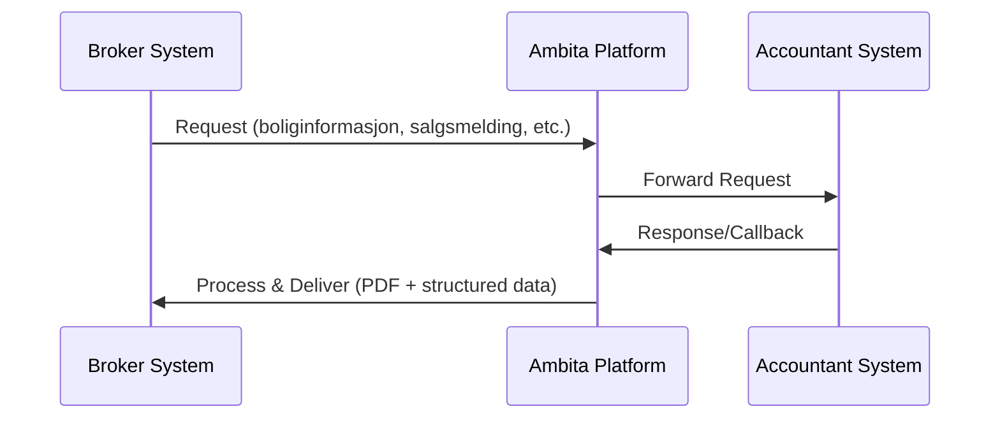

# WARP.md

This file provides guidance to WARP (warp.dev) when working with code in this repository.

## Repository Overview

This repository contains API documentation and type definitions for cooperation between brokers (meglere) and accountants (boligbyggelag) in the Norwegian real estate market. The system is designed to handle the complex workflow of property sales involving cooperative housing (borettslag), including preemption rights (forkjøpsrett), board approval (styregodkjenning), and ownership transfers.

## Repository Structure

```
.
├── README.md                    # Comprehensive API documentation with examples
├── requestTypes.ts              # TypeScript interfaces for request messages  
├── callbackTypes.ts             # TypeScript interfaces for response/callback messages
├── images/                      # Flowchart diagrams (.png and .graphml files)
│   ├── Information.png          # Boliginformasjon flow
│   ├── Clarification.png        # Forhåndsutlysing flow  
│   ├── Salesmessage.png         # Salgsmelding flow
│   └── Changetransferdate.png   # Endring overdragelsesdato flow
└── typespec/                    # TypeSpec definitions (alternative to TypeScript)
    ├── main.tsp                 # Complete TypeSpec schema definitions
    ├── package.json             # TypeSpec tooling dependencies
    ├── tspconfig.yaml           # TypeSpec compiler configuration
    └── node_modules/            # TypeSpec dependencies
```

## Development Commands

### TypeScript Development
```bash
# The TypeScript files are standalone - no build process needed
# They serve as documentation and type definitions for TypeScript consumers

# To validate TypeScript syntax (if you have tsc installed):
tsc --noEmit requestTypes.ts
tsc --noEmit callbackTypes.ts
```

### TypeSpec Development  
```bash
# Navigate to typespec directory
cd typespec/

# Install dependencies
npm install

# Compile TypeSpec to OpenAPI 3.0 (currently has compilation issues)
npx tsp compile .

# The output would normally go to tsp-output/ directory
# Generated files: openapi.yaml, openapi.json
```

**Note**: The TypeSpec compilation currently fails due to enum schema issues. This may need to be resolved by updating TypeSpec versions or fixing the schema definitions.

## Architecture Overview

The system handles three core operations:

### 1. **Clarification (Forhåndsutlysing)**
- **Purpose**: Pre-sale clarification of preemption rights
- **Trigger**: Seller wants to clarify preemption before sale
- **Flow**: Request → Early response → (Optional delay) → Final response
- **Duration**: Usually 3 months validity

### 2. **Ownership Change (Eierskifte/Salgsmelding)**  
- **Purpose**: Process actual property sale and ownership transfer
- **Trigger**: Property has been sold
- **Flow**: Request → Received → (Optional updates) → Completed
- **Includes**: Board approval process, buyer verification

### 3. **Arrears (Restanse)**
- **Purpose**: Handle outstanding debts and payments
- **Status**: Not yet fully designed/implemented

## Message Flow Pattern

All communication follows an asynchronous POST-based pattern:



### Request Types
- `boliginformasjon` - Property information request
- `forhandsutlysing` - Preemption clarification request  
- `salgsmelding` - Sales notification
- `endringoverdragelse` - Transfer date change
- `endringkjopere` - Buyer change
- `sluttbrev` - Final completion letter

### Response Naming Convention
- `[request]mottatt` - Acknowledged/received (optional)
- `[request]oppdatering` - Update/progress (optional) 
- `[request]fullfort` - Completed (required)
- `[request]utlopt` - Expired (when applicable)
- `feil` - Error response

## TypeScript vs TypeSpec

This repository maintains **dual definitions**:

### TypeScript Files (`*.ts`)
- **Primary source of truth** for API contracts
- Used directly by TypeScript/JavaScript consumers
- Contains comprehensive JSDoc comments and examples
- Should be **edited first** when making changes

### TypeSpec Files (`typespec/main.tsp`)
- Alternative schema definition language
- Generates OpenAPI 3.0 specifications
- Currently has compilation issues that need resolution
- Should be updated **after** TypeScript changes to maintain consistency

### Workflow for Changes
1. **Update TypeScript interfaces first** (`requestTypes.ts`, `callbackTypes.ts`)
2. **Mirror changes in TypeSpec** (`typespec/main.tsp`) 
3. **Test compilation**: `cd typespec && npx tsp compile .`
4. **Commit both versions together** to maintain sync

## Common Development Tasks

### Adding a New Message Type
1. Define request interface in `requestTypes.ts`
2. Define response interface(s) in `callbackTypes.ts` 
3. Add union type exports to `CallbackEvent` type
4. Update TypeSpec definitions in `typespec/main.tsp`
5. Add comprehensive examples to `README.md`
6. Create flow diagram if complex workflow

### Updating Existing Messages
1. Modify TypeScript interfaces
2. Update corresponding TypeSpec models
3. Verify backward compatibility
4. Update examples in README.md
5. Test with TypeSpec compiler

### PDF Generation Preferences
When working on PDF generation features, use **Inter** as the main font and **PT Serif** for heading elements in PDF generation.

## Message Examples Location

Detailed JSON examples for all message types are documented in `README.md`:
- Request examples with all required/optional fields
- Response examples showing typical callback flows  
- Error response examples with error codes
- State transition examples for complex flows

## Development Guidelines

- **Maintain consistency** between TypeScript and TypeSpec definitions
- **Preserve backward compatibility** when modifying existing interfaces
- **Use Norwegian field names** consistently (kjopesum, salgsmelding, etc.)
- **Document complex flows** with sequence diagrams in README
- **Include comprehensive examples** for all new message types
- **Test TypeSpec compilation** before committing changes

## Troubleshooting

### TypeSpec Compilation Issues
The current TypeSpec setup has compilation errors. To resolve:

1. Check TypeSpec version compatibility
2. Review enum definitions in `main.tsp`  
3. Consider updating to newer TypeSpec version
4. Validate against TypeSpec documentation for enum schemas

### Missing Dependencies
```bash
cd typespec/
npm install
```

This installs the TypeSpec compiler and OpenAPI 3.0 emitter tools.
